## Table of Contents

- [Using the Add/Remove Effects Macro](#using-the-addremove-effects-macro)
  - [Step 0: Pre-Setup](#step-0-pre-setup)
  - [Locating the Macro](#locating-the-macro)
- [Applying and Removing Conditions](#applying-and-removing-conditions)
  - [Select Condition](#select-condition)
  - [Applying and Removing Conditions](#applying-and-removing-conditions)
- [Using the Options Tickboxes](#using-the-options-tickboxes)
  - [Set Duration](#set-duration)
  - [Increase Level](#increase-level)
  - [Decrease Level](#decrease-level)
  - [Global Options: Condition Filtering and Keep Open](#global-options-condition-filtering-and-keep-open)
- [Creating Custom Conditions](#creating-custom-conditions)
  - [Basic Condition: Studied Target](#basic-condition-studied-target)
  - [Using Levels: Hindering Projectiles](#using-levels-hindering-projectiles)
  - [Setting a Duration: Distracting Blades](#setting-a-duration-distracting-blades)
  - [Removing Custom Conditions From Actors by Hand](#removing-custom-conditions-from-actors-by-hand)

## Using the Add/Remove Effects Macro

**What is it?** A means to (more) easily add and remove status conditions **and custom buffs** from _actors_. In Foundry, an _actor_ is any entity that exists in a scene, usually represented by a token on the map. Normally, only the GM has permissions to add and remove conditions from tokens, but with my script, we can all do it, _provided a GM is connected to the server_ (required for permissions purposes, and unavoidable). Especially with Spheres, where every character has a dozen features with different effects, triggers, and durations, something like this has already proven to be invaluable – and we've only been using it for 2-3 sessions so far.

**Do I need a macro?** Yes, this is used with a macro, but one is provided for you. You can find it in the Foundry macro directory, or wherever your GM has placed it, as shown in the instructions below.

### Step 0: Pre-Setup

After setting up the world script and the macro, the GM should also create a folder to hold the custom buffs created by the players. Go to the Items tab in foundry and create a folder. The folder's name must be **exactly** `Custom Conditions`. 

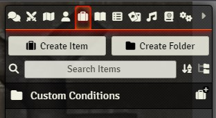

I recommend giving all players ownership of the folder, unless you want to set up all their features yourself. Alternatively, you might want to set up a subfolder per player and only grant players ownership to their respective subfolders.

Any items of type `Buff` placed in this folder will be picked up by the script, and will be usable by everyone (that means all players as well as the GM).

### Locating the Macro

**NB:** This step is mostly directed at my fellow players. In your game, your GM can place the macro anywhere else. And if you're the GM interested in using this pseudo-module, you should know that the `CustomCondDialog.js` file contains the macro, and `CustomCondManager.js` contains the world script.

On my end, I've placed the macros in a folder at the top of the macros directory. All players have been granted Observer permissions, so they can execute the scripts, but can't otherwise modify them.

You can find the macro in the **Foundry Macros Directory**, which is accessed in the following way:

* Click on the little folder icon beside your hotbar _(pic related, left)_
* Then open the "CUSTOM CONDITIONS MACROS" folder and see the "Add/Remove Conditions and Effects" macro _(pic related, middle)_. The world script is also there, but we don't need to do anything with it ever.
* Clicking it here will let you open and execute it, but you most likely want to drag the macro icon to your hotbar _(pic rel, right)_ for ease of use.

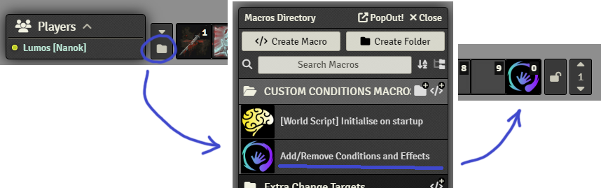

## Applying and Removing Conditions

When you click on the macro (when you execute it), you'll see the following window. Each option that isn't self-explanatory has a tooltip, so you might want to read those too.

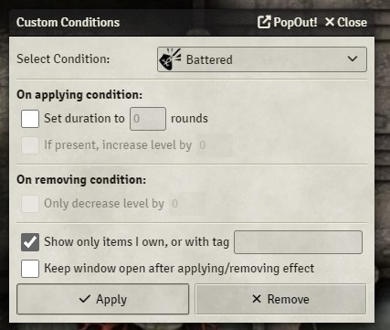

#### Select Condition
Lists all conditions defined by the Pathfinder 1e system. Also includes Battered (but I ought to be checking that the Spheres module is actually installed first).

**Any custom buff you place in the Custom Conditions folder will show up in this list.** Defining and using custom conditions is described in the following section.

You can select which condition you want to apply to the targeted tokens, or remove from the targeted tokens. Your choice is remembered, and any changes you make on the "set duration", "if present, increase level", or "only decrease level" fields is remembered _per condition_. For Pathfinder status conditions, the "increase level" and "decrease level" checkboxes are permanently disabled, as these conditions have no levels.

#### Applying and Removing Conditions

The process for using the macro is very simple:

* Select the condition you want to apply to or remove from the token(s) you are currently targeting.
* Click the Apply or Remove button to do so.

That's all. Keep the following in mind however:

* You must have a target to apply/remove the condition to. Targets can be selected using Foundry's built-in [Select Targets](https://foundryvtt.com/article/tokens/) tool.
* If a status condition is present on a targeted token and you choose the Apply option, it will not be reapplied or applied a second time.
* If a status condition is NOT present on a targeted token and you used the Remove option, that token will not be affected.
* On application, a Pathfinder game condition will be applied without a set duration; a custom effect will be applied with its default duration. This can be changed using the tickboxes.

## Using the Options Tickboxes
The tool provides certain options to expand your control over what is done to the targets. The following explains all available options in greater detail.

### Set Duration
This option is available for all features, including Pathfinder status conditions. Only has an effect when you Apply a condition, and not when you remove it. Your choice for this option is remembered per selected condition.

If _NOT_ set, the condition will use its default duration. A Pathfinder status condition will be applied infinitely (until removed) without a duration; a custom buff will use its default duration as defined in its item entry.

If set, the duration of the applied condition will be set to the chosen value, both for Pathfinder status conditions as well as custom ones. Note that the "End Timing" property of a custom condition (Turn Start/Turn End/Initiative) remains in force: only the actual duration, in rounds, is overridden.

The default value of this option is the default duration of the chosen condition (always infinite for Pathfinder status conditions).

### Increase Level
This option is only available for custom conditions. Only has an effect when you Apply a condition, and not when you remove it. Your choice for this option is remembered per selected condition.

If _NOT_ set, the condition will be applied with its default level. The level of a condition is set in the little box under its title bar (this is described in the next section), and is the variable available within the item as `@item.level`. A buff-type item normally doesn't use this for anything, and normally has a level of 0. Using the level of an effect is very handy on features that stack with multiple applications of themselves, such as Hindering Projectiles from Spheres of Might.

If set, and the condition is not present on a target, the condition will be added to that target and its level will be set to the chosen value. If the condition is already present on a target, the condition's level on that target will be _incremented_ by the chosen value.

The default value of this option is the default level of the chosen condition.

### Decrease Level
This option is only available for custom conditions. Only has an effect when you Remove a condition, and not when you apply it. Your choice for this option is remembered per selected condition.

If _NOT_ set, the condition will be removed from a target token if present on it, regardless of the condition's level.

If set, the condition on a target will be _decremented_ by the chosen value. If this sets the condition's level to 0 or lower, the condition will be fully removed. To use Hindering Projectiles from Spheres of Might as our example once again, a creature afflicted by this talent can either remove one stack of it as a move action, or remove all stacks of it as a full-round action. In the former case, you can tick this box and set its value to "1", and in the latter case, you can leave the box unticked to remove the condition completely.

The default value of this option is the default level of the chosen condition.

### Global Options: Condition Filtering and Keep Open
These options are always available, and do not vary based on the selected condition.

**Show Only Items I Own, or with Tag:** This applies only to custom condition items. If every player, as well as the GM, creates a dozen custom features to use with this tool, you probably don't want all of them to show up in your list of conditions to apply; not always, at least. If _NOT_ set, you'll see all custom conditions defined in the Custom Conditions folder. If set, you'll only see items that you own, as well as items that have the _tag_ that you specify in the respective textbox (if not left empty).

**Keep Window Open:** If this box is _NOT_ ticked, the window will close itself automatically when you apply or remove a condition. If set, it will remain open, and you can close it manually when you're done. Isn't that self-explanatory?

## Creating Custom Conditions
The following section describes how you can add your own custom conditions for use with this tool. This is done over the course of a few scenarios that increase in complexity.

### Basic Condition: Studied Target

1. Go to the Custom Conditions folder in the Items tab and create a new item. Make sure it's of type `Buff`. It's recommended to choose the `Miscellaneous` sub-type as well (if you don't, the script will override this for you).

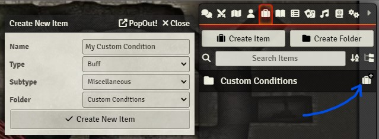

2. This is enough for the condition to show up in the list when the macro is used. You can change the name and the icon to whatever you like, and add a description or any other content to this item. By default, the condition will have no duration (i.e. it will have an infinite duration) and no level, and will make no changes to the token it's applied to.

Since we're creating the Slayer's Studied Target feature, which doesn't have a limited duration (for all intents and purposes) and doesn't impose any changes to the actor's stats, we're done here and needn't do anything else. The condition can be selected, applied to, and removed from targeted tokens. 

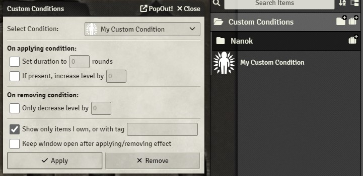

I have now changed the name and the icon of my condition to those I use for Studied Target.

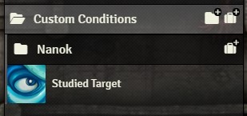

And here's how we can apply or remove this by hand:

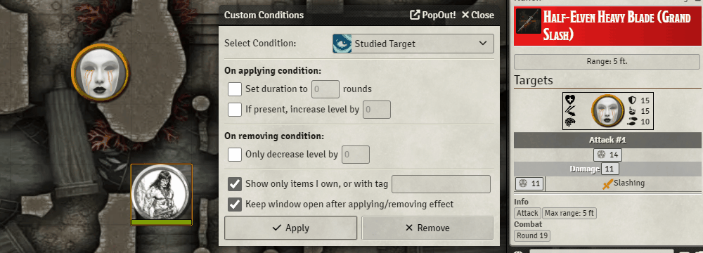

### Using Levels: Hindering Projectiles
In Spheres of Might, there's a combat talent in the Sniper sphere called *Hindering Projectiles*. We'll implement it right now, and here's what it does:

> _Your successful deadly shot leaves the weapon or ammunition used for the attack lodged in the wound, making it difficult for the target to move and react. The target takes a -2 penalty to attack rolls, AC, and CMD; multiple uses of this ability stack, increasing the penalty by an additional -2 per projectile lodged in the target. The target may remove a single projectile as a move action, or may remove multiple as a full-round action._

So, we need a -2 penalty to several stats, which can stack with itself, and which has no predetermined duration.

1. Create a new `Buff`-type item (`Miscellaneous` sub-type) in the Custom Conditions folder. Amend the name, icon, and description as you see fit.
2. Add changes to the custom conditon. Since this is not a simple binary condition which is either present or absent, but has different _levels_ of effect, we can make perfect use of the _level_ mechanism that the Pathfinder system provides.
3. We're done. Since this "condition" also has no fixed duration, we don't need to do anything else.

Here's how I've laid out the changes for this feature. Observe that I've set the item's default level to `1` and that I've keyed off all changes from that level.

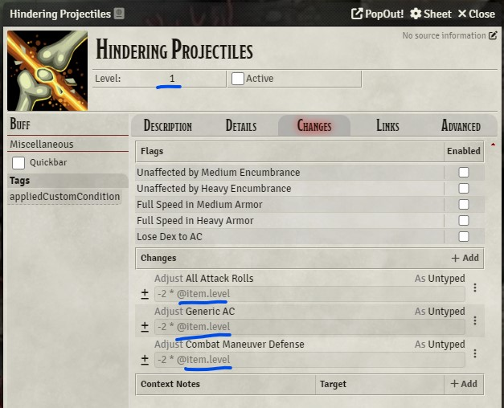

When we use the script to stack levels of this condition onto an actor, the changes will be cumulative (if we check the appropriate checkbox, of course).

Observe the level of the buff, shown in parentheses in the tooltip when i hover over the token, and how it changes as I apply or remove the condition on the actor.

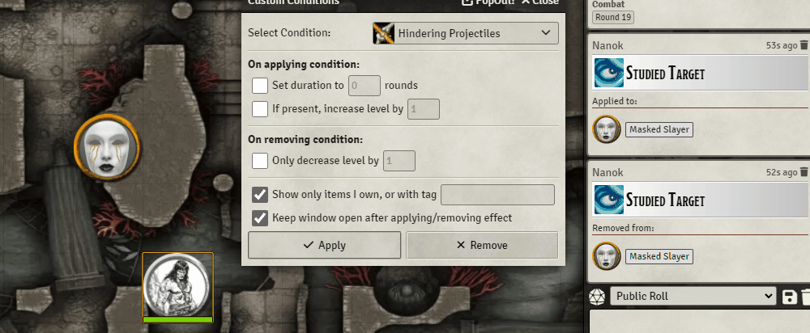

### Setting a Duration: Distracting Blades
The last example serves just to illustrate durations. In the Fencing sphere (Spheres of Might again), we can find the _Distracting Blades_ talent:

> _The target loses the ability to make attacks of opportunity for 1 round. For every 5 points of base attack bonus you possess, this penalty lasts for an additional round._

What are we working with? No levels and no real changes—the system doesn't give us a change target for opportunity attacks—but a fixed duration.

1. Create a new buff item in the Custom Conditions folder, as we've done before. Change its name, icon, and description accordingly.
2. Add changes? I've added a Context Notes change to "Attack Rolls" to say _"Distracting Blades: Can't make attacks of opportunity."_
3. Go to the Details tab for the item and set the duration as needed. My character is 5th level right now, so I've set the duration to 2 rounds. **Note that I've set the End Timing to Initiative.**

The Pathfinder system provides three possible End Timings: Turn Start, Turn End, and Initiative:

* **Turn Start/Turn End:** In our case (2 rounds), when the _second round begins_ and the _target's turn_ starts/ends, the condition will automatically end for it. These work wonderfully if you apply a condition with Turn Start/Turn End on yourself on your own turn, but can end faster than you might expect if your initiative count is lower than the target's.
* **Initiative:** In our case (2 rounds), when the _second round begins_ and _the current initiative count_ is hit, the condition will automatically end on the target. I prefer using this end timing when possible, as conditions applied on opportunity attacks don't necessarily align with the target's initiative count.

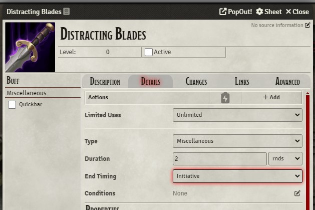

### Removing Custom Conditions From Actors by Hand
When you use this macro to apply a Pathfinder status condition (such as bleed, shaken, sickened, etc.) to an actor, you can remove it by going to the Buffs tab on the relevant actor's sheet and deselecting the condition, as normal.

When you apply a custom condition to an actor using this macro, the condition—which is a `Buff`-type item of sub-type `Miscellaneous`—can naturally be found in the Miscellaneous subsection of the Buffs tab in the actor's sheet. The custom condition is flagged as active, and includes an embedded script call that will automatically delete it from the actor whenever it is disabled. To remove the condition manually, simply tick the Active box and the condition will delete itself.

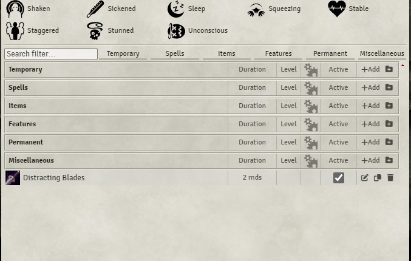
