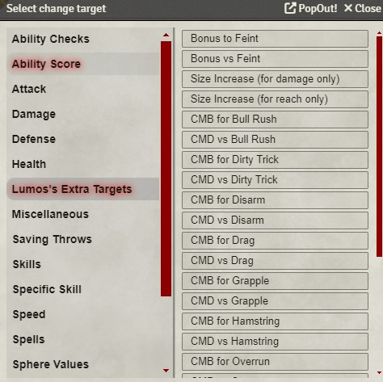
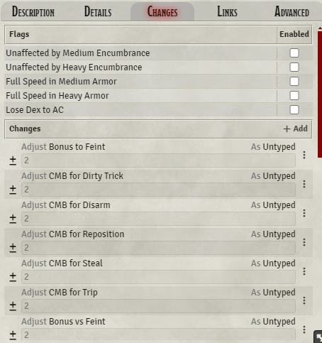
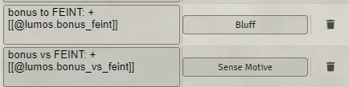
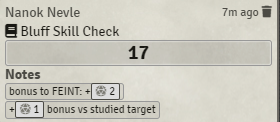
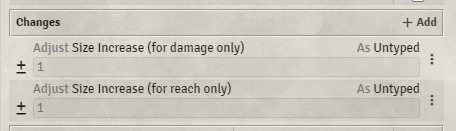
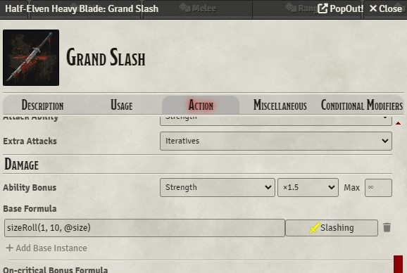
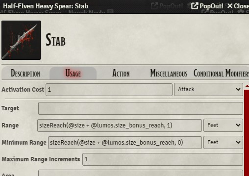
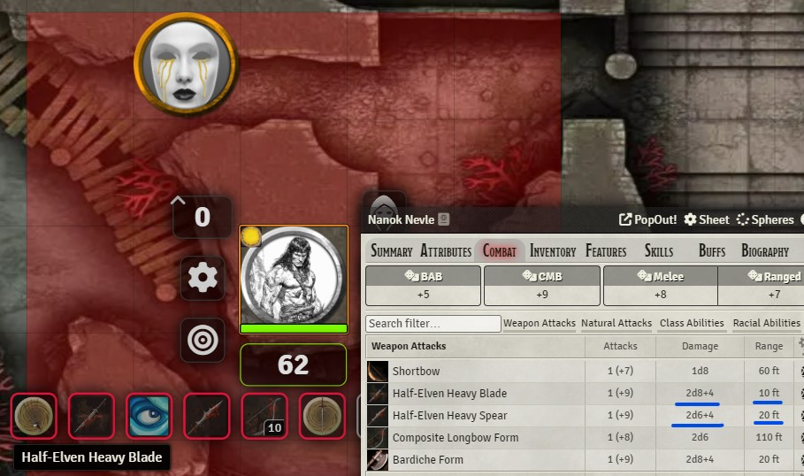

## Using Extra Change Targets
**What is it?** A script that adds additional change targets for things. The original goal was to add change targets for skill ranks, so our Spheres woes would be taken care of automatically, but that proved to be impossible. The script still works as-is, but only provides extra change targets for variables related to combat manoeuvres.

**Do I need a macro?** No. When you add a change to an item or feature, you'll see an additional category named "Lumos's Extra Targets". In it, you'll see plenty of options you can choose.




Note that these are **NOT** used internally by the system, but you can make use of them manually, like you would any other variable. The following is a list of all variables: 

```
bonus_feint
bonus_vs_feint
size_bonus_damage
size_bonus_reach

cmb_bull_rush
cmb_dirty_trick
cmb_disarm
cmb_drag
cmb_grapple
cmb_hamstring
cmb_overrun
cmb_reposition
cmb_steal
cmb_sunder
cmb_trip
```

Each `cmb_` variable also has a **CMD version** that starts with `cmd_` instead, e.g. `cmd_bull_rush` instead of `cmb_bull_rush`. Each of these is used with a prefix of `@lumos.` (this is shown in the images below).

So how do we actually use them then? For example: let's say you took the Deft Manoeuvres feat (from EITR), which gives you a +2 bonus to CMB and CMD for a number of manoeuvres, a +2 bonus when feinting, and a +2 bonus to CMD when a feint is made against you. Here's how I've laid out (a part of) my changes for this feat:




We're interested only in feinting for this example. After the list of changes in this feature (you can do it in any feature), I have added the following to the "Context notes" section. When I make a Bluff check, the value of this variable is reported correctly:

<p align="middle">
  
  
</p>

### Special Size Variables
You can use the feint variables and the `cmb_` and `cmd_` ones to add to context notes or wherever you like, but one of the main reasons I wrote this script was to support variable size changes. The pf1e system already takes your actor's size into account, but what if you're using an oversized weapon, or have a feature such as Encompassing Light from Spheres of Power (a magic talent that increases your effective size category by 1 for reach and damage only)?

With this script, this is now doable, albeit a little fiddly. Set up your change targets for Encompassing Light (I do this on a buff, so I can disable and enable it whenever I please). A value of `1` means "one size category".



Then the fiddly bit. The pf1e system exposes a `sizeRoll` function that computes the effective size of a weapon's damage dice based on the user's size category. The system also provides a `sizeReach` function that does the same thing for reach. The problem is, we can't just replace those functions so they take our new variables into account. **For every weapon we intend to use, we need to go into its actions and edit the damage and reach by hand.**

Go to your inventory, to any weapons you have or to any attacks you've created under the Combat tab. (You need to do this separately for any created attacks under the Combat tab, unfortunately.) Find your weapon attack's damage formula. This will likely be in _(your item) -> (your attack use) -> Action tab -> Damage -> Base Formula_.



`sizeRoll(1, 10, @size)` means "Roll ONE d10 at the actor's current size" (the actor's size is stored in the `@size` variable).

We want to replace this with the following:

```
sizeRoll(1, 10, @size + @lumos.size_bonus_damage)
```

If your weapon is not a 1d10 weapon, you'll see different values for the number and size of the dice; naturally, you don't want to change those. **This needs to be done separately for every attack for every weapon you want to use.** Sorry.


For reach, we need to hop over to the Usage tab for the attack. Unfortunately, there's no way to have the character sheet know that our melee range has been increased, so we'll have to explicitly specify our new reach. Set your melee attack's reach to "Feet", then place the following formula in the "Range" field.

```
sizeReach(@size + @lumos.size_bonus_reach, 0)
```

You should now recognise what we're doing with the variables. The `0` at the end is a flag for "is this a reach attack?". If you're modifying a weapon with reach, set this to 1; if not, set this to 0.

Here's an example with my not!branched spear _(I've slightly edited the way the popup looks so you can see the full thing)_. Note that I've filled in the minimum range field as well, using the zero for that formula.



When we hover over our the attack in our token's quickbar, the distances we can reach are hightlighted on the battlemap, all correctly. Note the damage and reach values reflected in the character sheet as well.

